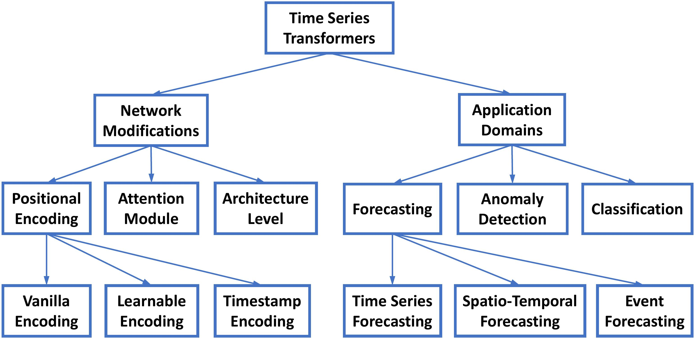

# Transformers in Time Series  

[](https://awesome.re) 
 

[](https://badges.pufler.dev/visits/qingsongedu/time-series-transformers-review)
<!--  -->


A professionally curated list of awesome resources (paper, code, data, etc.) on **Transformers in Time Series**, which is first work to comprehensively and systematically summarize the recent advances of Transformers for modeling time series data to the best of our knowledge.

We will continue to update this list with newest resources. If you found any missed resources (paper/code) or errors, please feel free to open an issue or make a pull request.

For general **AI for Time Series (AI4TS)** Papers, Tutorials, and Surveys at the **Top AI Conferences and Journals**, please check [This Repo](https://github.com/qingsongedu/awesome-AI-for-time-series-papers). 

For general **Recent AI Advances: Tutorials and Surveys in various areas (DL, ML, DM, CV, NLP, Speech, etc.)** at the **Top AI Conferences and Journals**, please check [This Repo](https://github.com/qingsongedu/awesome-AI-tutorials-surveys). 


## Survey paper

[**Transformers in Time Series: A Survey**](https://arxiv.org/pdf/2202.07125.pdf)

[Qingsong Wen](https://sites.google.com/site/qingsongwen8/), Tian Zhou, Chaoli Zhang, Weiqi Chen, Ziqing Ma, [Junchi Yan](https://thinklab.sjtu.edu.cn/) and [Liang Sun](https://scholar.google.com/citations?user=8JbrsgUAAAAJ&hl=en).

#### If you find this repository helpful for your work, please kindly cite our survey paper.

```bibtex
@article{wen2022tstransformers,
  title={Transformers in Time Series: A Survey},
  author={Wen, Qingsong and Zhou, Tian and Zhang, Chaoli and Chen, Weiqi and Ma, Ziqing and Yan, Junchi and Sun, Liang},
  journal={arXiv preprint arXiv:2202.07125},
  year={2022}
}
```

## Taxonomy of Transformers for time series modeling
<!--  -->
 <br />


## Application Domains of Time Series Transformers

### Transformers in Forecasting
#### Time Series Forecasting
* A Time Series is Worth 64 Words: Long-term Forecasting with Transformers, in *ICLR* 2023. [\[paper\]](https://openreview.net/forum?id=Jbdc0vTOcol) [\[code\]](https://github.com/yuqinie98/PatchTST)
* Crossformer: Transformer Utilizing Cross-Dimension Dependency for Multivariate Time Series Forecasting, in *ICLR* 2023. [\[paper\]](https://openreview.net/forum?id=vSVLM2j9eie)
* Scaleformer: Iterative Multi-scale Refining Transformers for Time Series Forecasting, in *ICLR* 2023. [\[paper\]](https://openreview.net/forum?id=sCrnllCtjoE)
* Non-stationary Transformers: Rethinking the Stationarity in Time Series Forecasting, in *NeurIPS* 2022. [\[paper\]](https://arxiv.org/abs/2205.14415) 
* Learning to Rotate: Quaternion Transformer for Complicated Periodical Time Series Forecasting”, in *KDD* 2022. [\[paper\]](https://dl.acm.org/doi/10.1145/3534678.3539234) 
* FEDformer: Frequency Enhanced Decomposed Transformer for Long-term Series Forecasting, in *ICML* 2022. [\[paper\]](https://arxiv.org/abs/2201.12740) [\[official code\]](https://github.com/MAZiqing/FEDformer)
* TACTiS: Transformer-Attentional Copulas for Time Series, in *ICML* 2022. [\[paper\]](https://arxiv.org/abs/2202.03528) 
* Pyraformer: Low-Complexity Pyramidal Attention for Long-Range Time Series Modeling and Forecasting, in *ICLR* 2022. [\[paper\]](https://openreview.net/forum?id=0EXmFzUn5I) [\[official code\]](https://github.com/alipay/Pyraformer) 
* Autoformer: Decomposition transformers with auto-correlation for long-term series forecasting, in *NeurIPS* 2021. [\[paper\]](https://proceedings.neurips.cc/paper/2021/hash/bcc0d400288793e8bdcd7c19a8ac0c2b-Abstract.html) [\[official code\]](https://github.com/thuml/autoformer)
* Informer: Beyond efficient transformer for long sequence time-series forecasting, in *AAAI* 2021. [\[paper\]](https://www.aaai.org/AAAI21Papers/AAAI-7346.ZhouHaoyi.pdf) [\[official code\]](https://github.com/zhouhaoyi/Informer2020) [\[dataset\]](https://github.com/zhouhaoyi/ETDataset) 
* Temporal fusion transformers for interpretable multi-horizon time series forecasting, in *International Journal of Forecasting* 2021. [\[paper\]](https://www.sciencedirect.com/science/article/pii/S0169207021000637) [\[code\]](https://github.com/mattsherar/Temporal_Fusion_Transform)
* Probabilistic Transformer For Time Series Analysis, in *NeurIPS* 2021. [\[paper\]](https://proceedings.neurips.cc/paper/2021/hash/c68bd9055776bf38d8fc43c0ed283678-Abstract.html)  
* Deep Transformer Models for Time Series Forecasting: The Influenza Prevalence Case, in *arXiv* 2020. [\[paper\]](https://arxiv.org/abs/2001.08317)
* Adversarial sparse transformer for time series forecasting, in *NeurIPS* 2020. [\[paper\]](https://proceedings.neurips.cc/paper/2020/hash/c6b8c8d762da15fa8dbbdfb6baf9e260-Abstract.html) [\[code\]](https://github.com/hihihihiwsf/AST)
* Enhancing the locality and breaking the memory bottleneck of transformer on time series forecasting, in *NeurIPS* 2019. [\[paper\]](https://proceedings.neurips.cc/paper/2019/hash/6775a0635c302542da2c32aa19d86be0-Abstract.html) [\[code\]](https://github.com/mlpotter/Transformer_Time_Series)
* SSDNet: State Space Decomposition Neural Network for Time Series Forecasting, in *ICDM* 2021, [\[paper\]](https://arxiv.org/abs/2112.10251)
* From Known to Unknown: Knowledge-guided Transformer for Time-Series Sales Forecasting in Alibaba, in *arXiv* 2021. [\[paper\]](https://arxiv.org/abs/2109.08381)
* TCCT: Tightly-coupled convolutional transformer on time series forecasting, in *Neurocomputing* 2022. [\[paper\]](https://www.sciencedirect.com/science/article/pii/S0925231222000571)
* Triformer: Triangular, Variable-Specific Attentions for Long Sequence Multivariate Time Series Forecasting, in *IJCAI* 2022. [\[paper\]](https://arxiv.org/abs/2204.13767)


 #### Spatio-Temporal Forecasting
* AirFormer: Predicting Nationwide Air Quality in China with Transformers, in *AAAI* 2023. [\[paper\]](https://arxiv.org/abs/2211.15979) [\[official code\]](https://github.com/yoshall/AirFormer) 
* Earthformer: Exploring Space-Time Transformers for Earth System Forecasting, in *NeurIPS* 2022. [\[paper\]](https://arxiv.org/abs/2207.05833) [\[official code\]](https://github.com/amazon-science/earth-forecasting-transformer)
* Bidirectional Spatial-Temporal Adaptive Transformer for Urban Traffic Flow Forecasting, in *TNNLS* 2022. [\[paper\]](https://ieeexplore.ieee.org/abstract/document/9810964)
* Spatio-temporal graph transformer networks for pedestrian trajectory prediction, in *ECCV* 2020. [\[paper\]](https://www.ecva.net/papers/eccv_2020/papers_ECCV/html/1636_ECCV_2020_paper.php) [\[official code\]](https://github.com/Majiker/STAR)
* Spatial-temporal transformer networks for traffic flow forecasting, in *arXiv* 2020. [\[paper\]](https://arxiv.org/abs/2001.02908) [\[official code\]](https://github.com/xumingxingsjtu/STTN)
* Traffic transformer: Capturing the continuity and periodicity of time series for traffic forecasting, in *Transactions in GIS* 2022. [\[paper\]](https://coolgiserz.github.io/publication/traffic-transformer-capturing-the-continuity-and-periodicity-of-time-series-for-traffic-forecasting/traffic-transformer-capturing-the-continuity-and-periodicity-of-time-series-for-traffic-forecasting.pdf)

 #### Event Forecasting
* Transformer Embeddings of Irregularly Spaced Events and Their Participants, in *ICLR* 2022. [\[paper\]](https://openreview.net/forum?id=Rty5g9imm7H) [\[official code\]](https://github.com/yangalan123/anhp-andtt)
* Self-attentive Hawkes process, in *ICML* 2020. [\[paper\]](http://proceedings.mlr.press/v119/zhang20q.html) [\[official code\]](https://github.com/QiangAIResearcher/sahp_repo)
* Transformer Hawkes process, in *ICML* 2020. [\[paper\]](https://proceedings.mlr.press/v119/zuo20a.html) [\[official code\]](https://github.com/SimiaoZuo/Transformer-Hawkes-Process)


### Transformers in Anomaly Detection
* CAT: Beyond Efficient Transformer for Content-Aware Anomaly Detection in Event Sequences, in *KDD* 2022. [\[paper\]](https://dl.acm.org/doi/abs/10.1145/3534678.3539155) [\[official code\]](https://github.com/mmichaelzhang/CAT)
* DCT-GAN: Dilated Convolutional Transformer-based GAN for Time Series Anomaly Detection, in *TKDE* 2022. [\[paper\]](https://ieeexplore.ieee.org/abstract/document/9626552)
* Concept Drift Adaptation for Time Series Anomaly Detection via Transformer, in *Neural Processing Letters* 2022. [\[paper\]](https://link.springer.com/article/10.1007/s11063-022-11015-0)
* Anomaly Transformer: Time Series Anomaly Detection with Association Discrepancy, in *ICLR* 2022. [\[paper\]](https://arxiv.org/abs/2110.02642) [\[official code\]](https://github.com/thuml/Anomaly-Transformer)
* TranAD: Deep Transformer Networks for Anomaly Detection in Multivariate Time Series Data, in *VLDB* 2022. [\[paper\]](https://arxiv.org/abs/2201.07284) [\[official code\]](https://github.com/imperial-qore/tranad)
* Learning graph structures with transformer for multivariate time series anomaly detection in IoT, in *IEEE Internet of Things Journal* 2021. [\[paper\]](https://arxiv.org/abs/2104.03466) [\[official code\]](https://github.com/ZEKAICHEN/GTA)
* Spacecraft Anomaly Detection via Transformer Reconstruction Error, in *ICASSE* 2019. [\[paper\]](http://www.utias.utoronto.ca/wp-content/uploads/2019/07/88-Spacecraft-anomaly-detection-via-transformer-reconstruction-error.pdf)
* Unsupervised Anomaly Detection in Multivariate Time Series through Transformer-based Variational Autoencoder, in *CCDC* 2021. [\[paper\]](https://ieeexplore.ieee.org/abstract/document/9601669)
* Variational Transformer-based anomaly detection approach for multivariate time series, in *Measurement* 2022. [\[paper\]](https://www.sciencedirect.com/science/article/abs/pii/S0263224122000914)

### Transformers in Classification
* TrajFormer: Efficient Trajectory Classification with Transformers, in *CIKM* 2022. [\[paper\]](https://dl.acm.org/doi/pdf/10.1145/3511808.3557481)
* TARNet : Task-Aware Reconstruction for Time-Series Transformer, in *KDD* 2022. [\[paper\]](https://dl.acm.org/doi/pdf/10.1145/3534678.3539329) [\[official code\]](https://github.com/ranakroychowdhury/TARNet)
* A transformer-based framework for multivariate time series representation learning, in *KDD* 2021. [\[paper\]](https://arxiv.org/abs/2010.02803) [\[official code\]](https://github.com/gzerveas/mvts_transformer)
* Voice2series: Reprogramming acoustic models for time series classification, in *ICML* 2021. [\[paper\]](https://arxiv.org/abs/2106.09296) [\[official code\]](https://github.com/huckiyang/Voice2Series-Reprogramming)
* Gated Transformer Networks for Multivariate Time Series Classification, in *arXiv* 2021. [\[paper\]](https://arxiv.org/abs/2103.14438) [\[official code\]](https://github.com/ZZUFaceBookDL/GTN)
* Self-attention for raw optical satellite time series classification, in *ISPRS Journal of Photogrammetry and Remote Sensing* 2020. [\[paper\]](https://arxiv.org/abs/1910.10536) [\[official code\]](https://github.com/marccoru/crop-type-mapping)
* Self-supervised pretraining of transformers for satellite image time series classification, in *IEEE Journal of Selected Topics in Applied Earth Observations and Remote Sensing* 2020. [\[paper\]](https://ieeexplore.ieee.org/abstract/document/9252123)
* Self-Supervised Transformer for Sparse and Irregularly Sampled Multivariate Clinical Time-Series, in *ACM TKDD* 2022. [\[paper\]](https://arxiv.org/abs/2107.14293) [\[official code\]](https://github.com/sindhura97/STraTS)


## Time Series Related Survey
* Time series data augmentation for deep learning: a survey, in *IJCAI* 2021. [\[paper\]](https://arxiv.org/abs/2002.12478)
* Neural temporal point processes: a review, in *IJCAI* 2021. [\[paper\]](https://arxiv.org/abs/2104.03528v5)
* Time-series forecasting with deep learning: a survey, in *Philosophical Transactions of the Royal Society A* 2021. [\[paper\]](https://royalsocietypublishing.org/doi/full/10.1098/rsta.2020.0209)
* Deep learning for time series forecasting: a survey, in *Big Data* 2021. [\[paper\]](https://www.liebertpub.com/doi/abs/10.1089/big.2020.0159)
* Neural forecasting: Introduction and literature overview, in *arXiv* 2020. [\[paper\]](https://arxiv.org/abs/2004.10240) 
* Deep learning for anomaly detection in time-series data: review, analysis, and guidelines, in *Access* 2021. [\[paper\]](https://ieeexplore.ieee.org/abstract/document/9523565) 
* A review on outlier/anomaly detection in time series data, in *ACM Computing Surveys* 2021. [\[paper\]](https://arxiv.org/abs/2002.04236)
* A unifying review of deep and shallow anomaly detection, in *Proceedings of the IEEE* 2021. [\[paper\]](http://128.84.4.34/abs/2009.11732)
* Deep learning for time series classification: a review, in *Data Mining and Knowledge Discovery* 2019. [\[paper\]](https://link.springer.com/article/10.1007/s10618-019-00619-1?sap-outbound-id=11FC28E054C1A9EB6F54F987D4B526A6EE3495FD&mkt-key=005056A5C6311EE999A3A1E864CDA986)
* More related time series surveys, tutorials, and papers can be found at this [repo](https://github.com/qingsongedu/awesome-AI-for-time-series-papers).

 
## Transformer/Attention Tutorial/Survey in Other Disciplines
* Everything You Need to Know about Transformers: Architectures, Optimization, Applications, and Interpretation, in *AAAI Tutorial* 2023. [\[link\]](https://transformer-tutorial.github.io/aaai2023/)  
* Transformer Architectures for Multimodal Signal Processing and Decision Making, in *ICASSP Tutorial* 2022. [\[link\]](https://transformer-tutorial.github.io/icassp2022/)  
* Efficient transformers: A survey, in *ACM Computing Surveys* 2022. [\[paper\]](https://dl.acm.org/doi/10.1145/3530811) [\[paper\]](https://arxiv.org/abs/2009.06732)
* A survey on visual transformer, in *IEEE TPAMI* 2022. [\[paper\]](https://arxiv.org/abs/2012.12556)
* A General Survey on Attention Mechanisms in Deep Learning, in *IEEE TKDE* 2022. [\[paper\]](https://personal.eur.nl/frasincar/papers/TKDE2022/tkde2022.pdf)
* Attention, please! A survey of neural attention models in deep learning, in *Artificial Intelligence Review* 2022. [\[paper\]](https://link.springer.com/article/10.1007/s10462-022-10148-x)
* Attention mechanisms in computer vision: A survey, in *Computational Visual Media* 2022. [\[paper\]](https://link.springer.com/article/10.1007/s41095-022-0271-y)
* Survey: Transformer based video-language pre-training, in _AI Open_ 2022. [\[paper\]](https://www.sciencedirect.com/science/article/pii/S2666651022000018)
* Transformers in vision: A survey, in *ACM Computing Surveys* 2021. [\[paper\]](https://arxiv.org/abs/2101.01169)
* Pre-trained models: Past, present and future, in *AI Open* 2021. [\[paper\]](https://www.sciencedirect.com/science/article/pii/S2666651021000231)
* An attentive survey of attention models, in *ACM TIST* 2021. [\[paper\]](https://arxiv.org/abs/1904.02874)
* Attention in natural language processing, in *IEEE TNNLS* 2020. [\[paper\]](https://ieeexplore.ieee.org/stamp/stamp.jsp?tp=&arnumber=9194070)
* Pre-trained models for natural language processing: A survey, in *Science China Technological Sciences* 2020. [\[paper\]](https://link.springer.com/article/10.1007/s11431-020-1647-3)
* A review on the attention mechanism of deep learning, in *Neurocomputing* 2021. [\[paper\]](https://www.sciencedirect.com/science/article/abs/pii/S092523122100477X)
* A Survey of Transformers, in _arXiv_ 2021. [\[paper\]](https://arxiv.org/abs/2106.04554)
* A Survey of Vision-Language Pre-Trained Models, in _arXiv_ 2022. [\[paper\]](https://arxiv.org/abs/2202.10936)
* Video Transformers: A Survey, in *arXiv* 2022. [\[paper\]](https://arxiv.org/abs/2201.05991)
* Transformer for Graphs: An Overview from Architecture Perspective, in _arXiv_ 2022. [\[paper\]](https://arxiv.org/abs/2202.08455)
* Transformers in Medical Imaging: A Survey, in _arXiv_ 2022. [\[paper\]](https://arxiv.org/abs/2201.09873) 
* A Survey of Controllable Text Generation using Transformer-based Pre-trained Language Models, in _arXiv_ 2022. [\[paper\]](https://arxiv.org/abs/2201.05337) 

